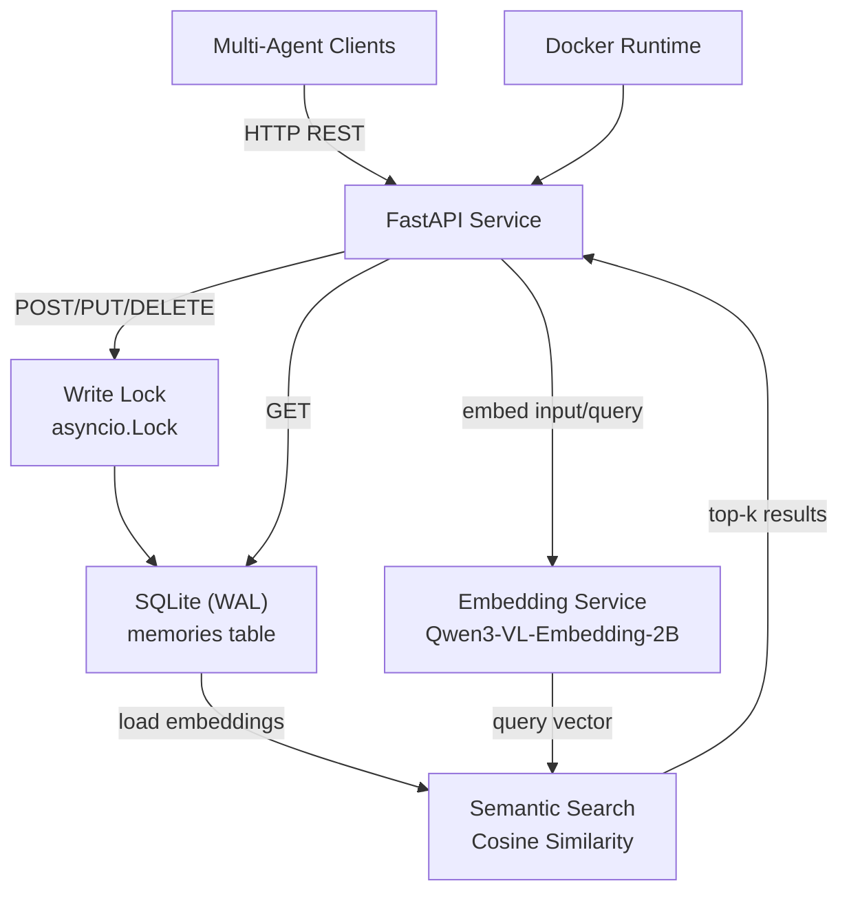
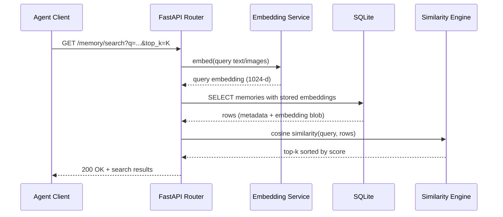

# Architecture Decision Record

**Progetto:** Multi-Agent Shared Memory Service
**Data:** 2026-06-24
**Autore:**

## Decisione

È stato costruito un microservizio REST per memoria condivisa multimodale tra agenti, con persistenza SQLite, generazione embedding (testo + immagini Base64) tramite Qwen3-VL-Embedding-2B e retrieval semantico via cosine similarity.

## Contesto

Il sistema serve a permettere collaborazione e coordinazione tra agenti in rete tramite una memoria condivisa interrogabile e aggiornabile rapidamente. L'obiettivo è un servizio leggero, efficiente e containerizzabile, con supporto multimodale per scenari RAG distribuiti.

## Piattaforme scelte

- Frontend: non applicabile (servizio API-only; interfaccia Swagger/OpenAPI di FastAPI)
- Backend: Python 3.11+, FastAPI, Uvicorn
- Database: SQLite (WAL mode)
- Deploy: Docker (runtime CUDA con fallback CPU)

## Componenti principali

- API REST: espone endpoint CRUD, recent, key lookup, search semantica, embed debug e health check.
- Embedding Service: carica Qwen3-VL-Embedding-2B all'avvio e produce vettori normalizzati per testo/immagini.
- Persistence Layer: gestisce connessioni SQLite e inizializzazione schema/indici della tabella memories.
- Search Engine in-memory: calcola cosine similarity su embedding deserializzati da BLOB e restituisce top-k.
- Concurrency Control: serializza scritture con asyncio.Lock mantenendo letture concorrenti.
- Container Runtime: esegue il servizio in Docker per esposizione su rete.

## Diagrammi di flusso

### Vista architetturale

### Flusso richiesta semantica (GET /memory/search)

## Decisioni architetturali

- FastAPI invece di framework Python più pesanti: scelto per rapidità di sviluppo API, typing, async e OpenAPI integrato.
- SQLite invece di database esterni: scelto per semplicità operativa e overhead ridotto nel contesto "tiny service".
- Qwen3-VL-Embedding-2B invece di embedding solo testuali: scelto per supporto multimodale (testo+immagini) richiesto dal brief.
- Cosine similarity in-memory invece di vector DB dedicato: scelto per dataset piccoli/medi e implementazione minimale; estendibile in futuro (es. FAISS).
- Lock esplicito sulle scritture invece di piena concorrenza write-write: scelto per ridurre contese e rischi con SQLite.
- Base64 inline nel payload invece di file upload/storage: scelto per coerenza con i vincoli del brief e semplificazione I/O.
- Caricamento modello in lifespan FastAPI invece di lazy load per request: scelto per evitare cold-load ripetuti e stabilizzare la latenza per richiesta.

## Vincoli

- Nessuna autenticazione in questa fase.
- Servizio accessibile in rete (bind 0.0.0.0).
- Lightweight/efficient by design.
- GPU opzionale con fallback CPU.
- Immagini accettate solo in Base64 inline (no file storage).
- Nessuna dipendenza esterna obbligatoria per il database (SQLite embedded).
- Nota operativa da allineare: nel brief è indicata porta 8010, mentre Dockerfile corrente espone/esegue su 8001.

## Cosa NON è in scope

- Sistema di autenticazione/autorizzazione.
- Gestione upload file o object storage per media.
- Vector database dedicato (FAISS/Milvus/Pinecone) in questa fase.
- Orchestrazione multi-service complessa oltre al singolo microservizio.
- UI applicativa dedicata oltre alla documentazione API automatica.

## Feature future pianificate
